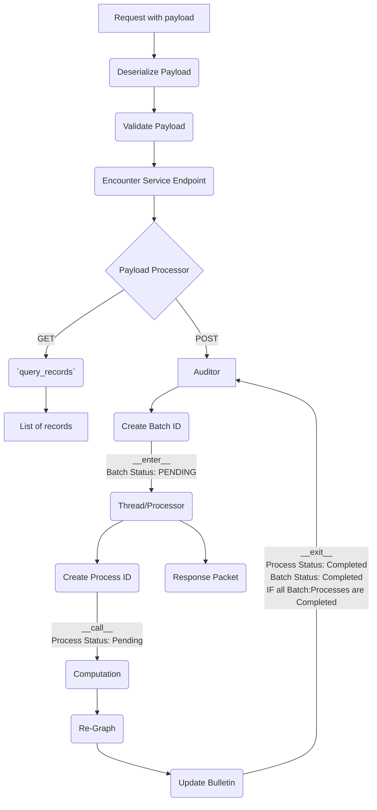
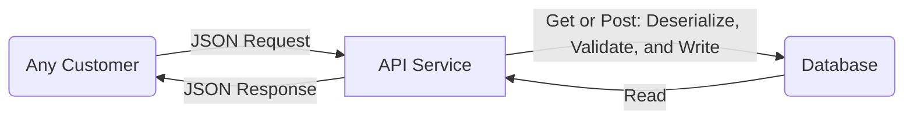
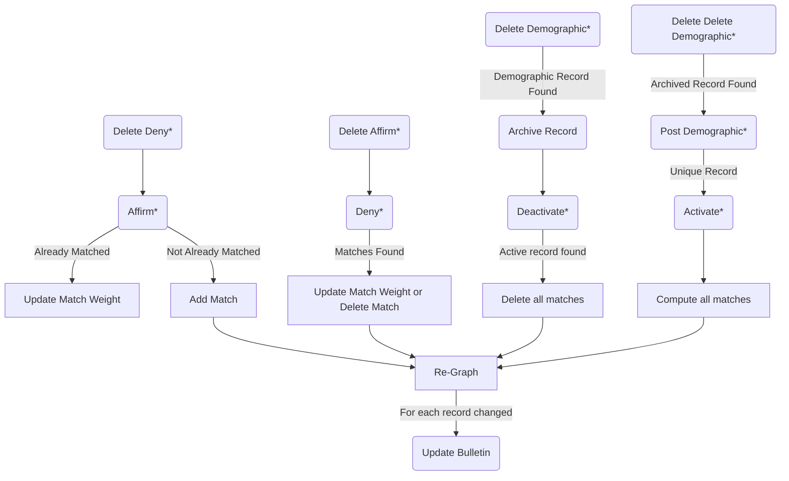
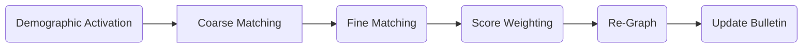
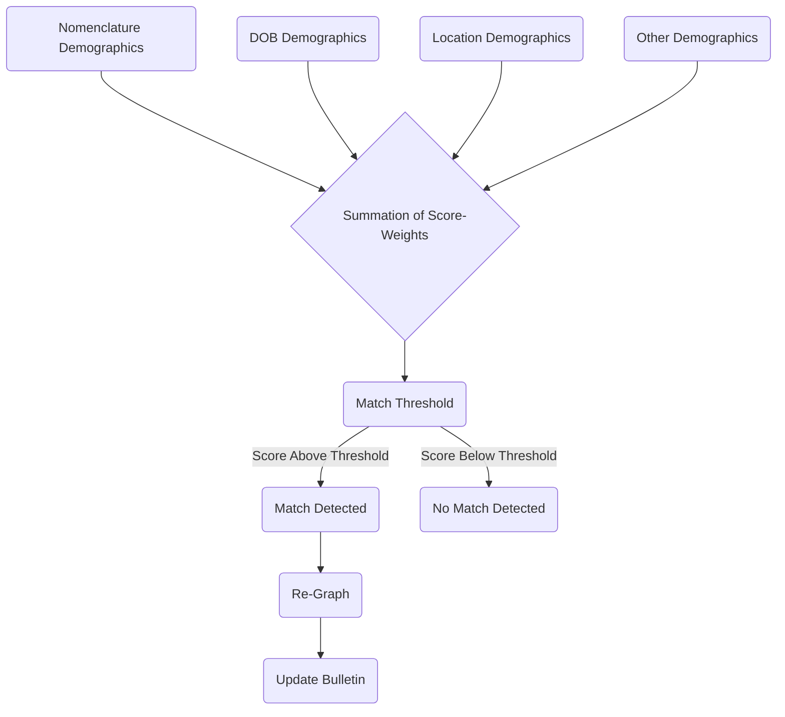
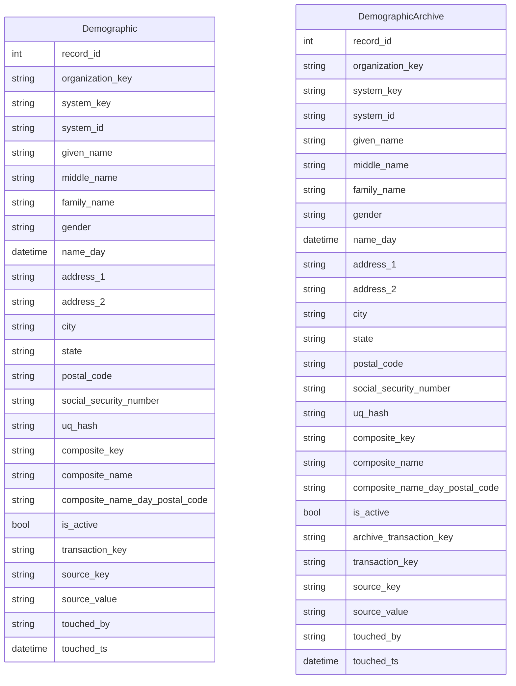
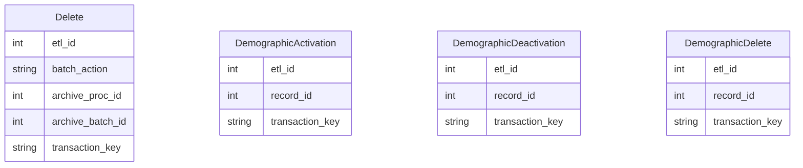
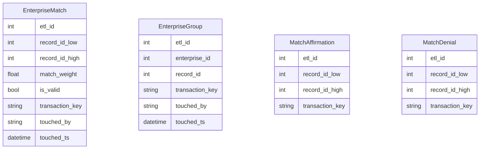
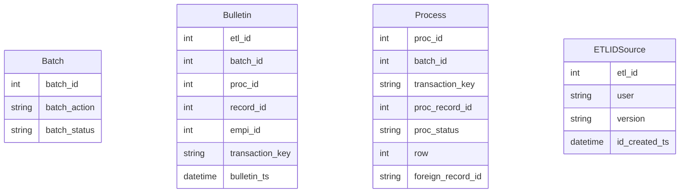
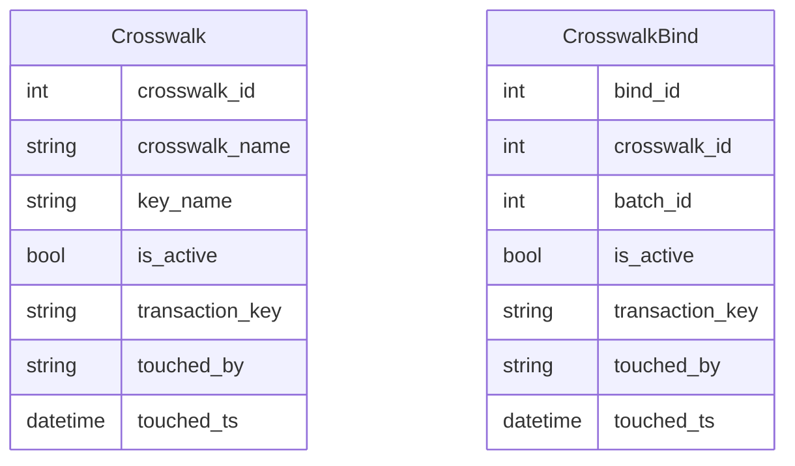

# `master-patient-index`
Master Patient Index is a containerized API microservice with a PostgreSQL database. MPI is used to improve the interoperability of medical records by conducting entity resolution (matching) on patient records.
Improved entity resolution on patient records is vital because medical errors are a huge cause of death in the United States. Chart errors and duplication of records has other big impacts on facilities' costs as well.

MPI is conceptualized as a data warehouse using dimensional data modeling practices that sits alongside your own data pipeline. You `POST` patient demographic records to the warehouse and those records are activated into the network of patient graphs. If a record is matched to any given record(s), they will share an `enterprise_id` as a unique serial number representing a patient. The `enterprise_id` is clad from the lowest ID in any group. Ongoing changes to these graphs are published to a `bulletin`.

The entire service lives inside a container and your instance(s) may be placed anywhere within your cloud security perimeter easily.

In sum, the following 8 cursor-behaviors (acting on your patient network) are supported via POST to a service endpoint:

>**Post Demographic**: adds and activates a demographic to your warehouse
> 
>**Delete Demographic**: deactivates, archives, and removes a demographic from your warehouse
> 
>**Activate Demographic**: adds the record as a node to the patient network and computes it with potential matches, updating the network as necessary
> 
>**Deactivate Demographic**: removes the record as a node from the patient network and re-computes the network in its absence
> 
>**Affirm Match**: adds 1.0 to the match-weight attribute of the match record 
> 
>**Deny Match**: subtracts 1.0 from the match-weight attribute of the match record
> 
>**Delete (Delete Demographic)**: fetches a deleted record from the archive, and passes it back in via a Post Demographic (above)
> 
>**Delete (Affirm or Deny)**: enacts the opposing behavior on request 
> 

MPI incorporates a fully audited data warehouse, where every transaction is reversible using the commands outlined above. MPI traces a complete record of everything that ever happens on MPI. This unleashes your total quality control processes according to your own customized design and any particular data quality needs you may have as well.

When demographic records are activated (as above), the newly introduced record is paired off with a collection of coarse matches. Each pair-wise comparison runs a battery of deterministic tests and stores these in an encrypted metric JSON object for storage on your volume (in "toy mode" (see below) this is bypassed and no metric files are created). Special encrypt/decrypt methods ensure these metric files are only legible inside the audited universe of the service to suit your access control and security needs.

Score-weighting refers to the activity of reading the metric object and assessing between 0 and 1 how likely the two records are representative of the same patient. Scores exist on a range of 0 to 1, with the threshold for matching currently set at 0.5.

A finalized score-weighting mechanism is **not supplied** because this needs to be responsive to your data quality. For instance, if your date of birth records are fantastic, you can assign them a higher score-weight on matches than if this data is of very poor quality, and so on with all other data attributes. One of the conceits of this application is that you can supply independent analytic heft. This is where.

Because this system handles an ongoing, human process, with a very special set of cursors to enable full reversibility, the state of your patient network and its collection of patient graphs is always, in the present moment, assumed to be your "least wrong" network. What this means, practically, is that most access to this service by the customer tranche interested in retrieving patient graphs and/or unique patient serials will do so by accessing or subscribing to the `bulletin`. Put another way, the serialization here is not meant to be stored elsewhere, but fetched at customers' own run-time, when and as needed.  

---

# Getting Started
It's as easy as...
## 1 - Install Docker, Python, and Flask, and this Repo
Developed with Docker version 23.0.5, build bc4487a  
Python 3.10  
Flask 2.2.2

## 2 - Set up three hidden files your Docker build will rely on
Place these .env files in `/` with your own `username`, `password`, and `database`. The filename starts with a `.` because these are meant to be hidden files.

### .env.dev
FLASK_APP=project/__init__.py  
FLASK_DEBUG=1  
DATABASE_URL=postgresql://`username`:`password`!@db:5432/`database`  
SQL_HOST=db  
SQL_PORT=5432  
DATABASE=postgres  
APP_FOLDER=/usr/src/app  

### .env.prod
FLASK_APP=project/__init__.py  
FLASK_DEBUG=1  
DATABASE_URL=postgresql://`username`:`password`!@db:5432/`database`  
SQL_HOST=db  
SQL_PORT=5432  
DATABASE=postgres  
APP_FOLDER=/home/app/web  

### .env.prod.db
POSTGRES_USER=`username`  
POSTGRES_PASSWORD=`password`  
POSTGRES_DB=`database`  

## 3 - Spin up a container
### Prod
>sudo docker compose -f docker-compose.yml up -d --build  
sudo docker compose exec web python manage.py create_db  
sudo docker compose -f docker-compose.yml down -v  
sudo docker compose exec db psql --username=<username> --dbname=<database>  

The `create_db` command above should only be run once (on initial start) or whenever you really want to give the DB a blow-out.

This container uses Gunicorn and Nginx, and its own database and volume.

### Dev
>sudo docker compose -f docker-compose.dev.yml up -d --build  
sudo docker compose -f docker-compose.dev.yml down -v  
sudo docker compose exec db psql --username=<username> --dbname=<database>  

The dev container uses the flask development web server, and its own database and volume. This container runs `create_db` on startup.

---

# Product Philosophy and Vision

This product is intended to have 5 key values. The solution:
>- enables a human process
>- provides an elegant interface
>- has independent/DIY score-weighting for matches
>- is truly agnostic of your existing tooling
>- is open source

There are 8 product design conceits which we believe improve the yield of this system:
>- the battery of deterministic tests yields a stored metric for repeatability
>- the activity of match-scoring is decoupled from computing the metric (maintaining a posture that you can always go back and apply new weights, or even new tests)
>- this means variable match-scoring is a native feature
>- the graph cursor is placed in the hands of your clinicians
>- the real state of your demographic data store is also in the hands of your clinicians
>- the warehouse maintains a robust audit trail
>- any UI or workflow may be built on top of the API easily
>- the graph cursor applies graph theory natively

We (try to) adhere to the following product-code principles:
>- there is a clear separation of concerns
>- each module does one thing and is short (under 250 lines/10kb, where possible)
>- each function does one thing and is short (clear exception: funcs working with SQLA can be long)
>- the name-space is clear, consistent, normative, and descriptive throughout
>- callable context managers (objects composed with `__call__`, `__enter__`, and `__exit__` implemented) provide full warehouse observability for every process whatsoever and ensure the service architecture is tightly wrapped, everywhere 
>- the correspondence between the service endpoints, data processors, payload validators, and the data model is intentionally maintained with a `coupler`
>- docstrings always; type-hints and other annotations are supplied as much as possible which is nearly always
>- the code is subject to static analysis (via PyCharm CE) and strictly maintained to all PEPs. 
>- testing at the "fair enough" level. Every module is validated, but this product has no devops opinion. This means it is light on integration tests, smoke tests, and test automation, broadly.

It is absolutely necessary that you create an airtight testing seal with additional coverage within the context of your own deployment.

---

# Project Details

To become a contributor to this project, read the [Code of Conduct](https://github.com/HealthIQ-LLC/master-patient-index/blob/main/CODE_OF_CONDUCT.md), pull my email out of it, and get in touch without hesitation.

As of now, there is no helpdesk automation or administration for issues, tickets, or anything else. This is a ground-floor project, and if you want commit-level access because you have a strong opinion about these features, let's talk!

---
# Service Endpoints

`POST` requests alter the patient network using processors uniquely dedicated to each endpoint, while `GET` requests provide visibility throughout the entire data model.

| Name                      | Route (`'/api_{version}/'...`) | Methods           |      
|---------------------------|--------------------------------|-------------------|
| Activate Demographic      | `'activate_demographic'`       | `['GET', 'POST']` |
| Archive Demographic       | `'archive_demographic'`        | `['GET']`         |
| Deactivate Demographic    | `'deactivate_demographic'`     | `['GET', 'POST']` |
| Delete Action             | `'delete_action'`              | `['GET', 'POST']` |
| Delete Demographic        | `'delete_demographic'`         | `['GET', 'POST']` |
| Demographic               | `'demographic'`                | `['GET', 'POST']` |
| Affirm Match              | `'match_affirm'`               | `['GET', 'POST']` |
| Deny Match                | `'match_deny'`                 | `['GET', 'POST']` |
| Enterprise Group          | `'enterprise_group'`           | `['GET']`         |
| Enterprise Match          | `'enterprise_match'`           | `['GET']`         |
| Batch                     | `'batch'`                      | `['GET']`         |
| Bulletin                  | `'bulletin'`                   | `['GET']`         |
| Process                   | `'process'`                    | `['GET']`         |
| ID Source                 | `'etl_id_source'`              | `['GET']`         |
| Add Crosswalk             | `'add_crosswalk'`              | `['GET', 'POST']` |
| Activate Crosswalk        | `'activate_crosswalk'`         | `['GET', 'POST']` |
| Deactivate Crosswalk      | `'deactivate_crosswalk'`       | `['GET', 'POST']` |
| Add Crosswalk Bind        | `'add_crosswalk_bind'`         | `['GET', 'POST']` |
| Activate Crosswalk Bind   | `'activate_crosswalk_bind'`    | `['GET', 'POST']` |
| Deactivate Crosswalk Bind | `'deactivate_crosswalk_bind'`  | `['GET', 'POST']` |

---
# Code Tour
The Docker container is built from `/`. The python package itself is in `/services/web/project`.

- `__init__`: all payload processing is wrapped, and endpoint rules are registered
- `__version__`: just the software version
- `app`: Flask `app` object is created and configured
- `auditor`: supplies a callable context-manager to trace all transactions
- `coupler`: intentional coupling of data model, data processor, payload validator, and supported protocol methods
- `crosswalk`: a set of processors for maintaining a foreign-key ID crosswalk 
- `crypto_s3`: an encrypted getter/setter for handling metric results data. Not fully implemented and not tested at this time
- `data_utils`: some helper functions for handling data idiomatically
- `engine`: match-computation is orchestrated here, metrics result
- `graphing`: arranging graphs from metrics and updating the database
- `logger`: a formatted, leveled, handled, named, and located logging object
- `matching`: a battery of deterministic string-matching tests
- `model`: the database connection context, `db`, and the entire data model of tables which are bound to endpoints via `coupler`
- `processor`: A wrapper for all transactions and selections, status updates, and 8 unique data processors which are bound to endpoints via `coupler`
- `validators`: validating client payloads with custom validators which are bound to endpoints via `coupler`

---

# Bottomless Undo Support

### Reversibility is a core concept to MPI. 

We believe it makes for a far better data quality and quality control toolkit if this service supports any process of continuous and ongoing self-correction uniformly, throughout. We do this by giving every command its opposite so that literally every transaction is totally reversible. This means your patient network reflects the latest curation work by your team, and your patient charts are not waiting for a monthly, weekly, or even a daily sync.

### `demographic` and `delete_demographic` and `delete_action`
`POST` a demographic record and it will hit `activate` (see below).
`demographic_delete`, on the other hand, will `deactivate` a record, and supply it to `archive_demographic` before deleting it from `demographic`
`delete_action` with a payload including k=v: `batch_action='demographic'` will use the endpoint to find the target record in the `archive_demographic` table, and send it back to `demographic` via `POST` 

This means a record may be added and removed and re-added, and it may be activated and deactivated.

### `affirm` and `deny`
Score-weights sampled via the deterministic matching mechanism are generated in the range of `0` to `1.0`. By hard-coded default, the match threshold is `0.5`. This is the threshold above which pairwise comparison is said to result in a match and beneath which there is determined to be no match.

`affirm` is called on a `delete_action(batch_action='deny')` request and `deny` is called on a `delete_action(batch_action='affirm')` request.

The actions of `affirm` and `deny` each impact the match score (score weight) by `1.0` in the `+` and `-` directions, so on their own they categorically force a matching result (either way). As opposites, `affirm` and `deny` can also effectively cancel each other out which is why ordering the Delete of one of these actions records your Delete request and then calls the opposite command. 

With that in mind, this feature is designed to support a tug-of-war polling process whereby multiple clinician/operators may be given the same work list to curate with their `affirm` and `deny` responses. If you give it to three (or more) people, any result will be 1.0 for each headcount of margin and this will either enforce a match (if `affirm`) or negate a match (if `deny`) arithmetically.

While `affirm` and `deny` do oppose each other naturally, twiddling them via the `delete_action` endpoint specifically unpicks a record intentionally, for QC-purposes.

### `activate` and `deactivate`
`activate` runs a record through the matching engine, and graphs it into the patient network. This includes updating the `demographic`, `activate_demographic`, `enterprise_match`, `enterprise_group`, and `bulletin` tables whenever an update or change to the network is transacted. A newly activated record may stand alone, or it may be grafted on to an existing patient graph. Where this graft occurs, the `enterprise_id` of the graph may change or it may remain the same but the newly added record will produce a `bulletin` about itself in any case.

`deactivate` removes all `enterprise_match`, `enterprise_group` records where the target record is implicated, and recursively collects every record in the original patient graph and runs each one through the `GraphCursor` again, respective of the aforementioned match and group updates.   

If you `activate` and then `deactivate` a record, the patient network will work as if you had never introduced the record. Meanwhile, if you `deactivate` and then `activate` a record, the patient network will include the record exactly as if it had never been deactivated. `POST` a demographic record and it will be activated by default. Delete a demographic via `delete_demographic` and the record will hit `deactivate` on the way out.  

---

# The Data Warehouse

All four serialization tracks are provided along one number-line. Meta-data is collected via `POST` request payload hitting any endpoint, and this is inserted into the number-line source table, `ETLIDSource`, with an auto-incremented ID returning. This ID forms the primary key of a new record insertion which may be staged for any table in the model. Control over the minting of keys and the ties between them and any transactional activity supports the goals of observability and reversibility. Traversing the keys that are created unleashes numerous ways of querying, analyzing, and assessing the records in fine grain.

See the wiring diagrams for the data model in the **Flow Charts** section below but in short: any `POST` request (one which alters the network) spawns a `batch`. One attribute of this request is the `endpoint` it came in on (referred to here as `batch_action`) and another is the `batch_key`. Any record altered as a result of a single request (remember: many records could be affected by any one request) will have that change associated to the `batch_id`. There is also a `batch_status` which goes from `PENDING` to `COMPLETED` as computational conditions are met.

Meanwhile, one request may trigger a sequence of individual transactions, each on one record somewhere in the model. Each of these transactions, the atomic behavior of this service, spawns a `process`. Among the attributes of the `process` you'll find a `process_id`, its parent the `batch_id`, our internal primary key of the record, your source primary key of the record, and a `transaction_key`. The `transaction_key` is formed as follows `f'{batch_id}_{process_id}'.` The `process` record also has a `process_status` which goes from `PENDING` to a custom verb which says what just happened (eg. 'POSTED', 'ACTIVATED', 'ARCHIVED', etc., etc. etc.) by way of usages of `processor.update_status()`.

The auditor hands out all of these keys from the ID source, in context, and the audit records in `Batch` and `Process` provide visibility into every distinct transaction.

---
# The `GraphCursor` and `GraphReCursor`

In graph theory, a graph is constructed from nodes and edges. In MPI the nodes are patient records, and edges the match score that exists between them. The operation of MPI can thus be seen as a continuous adding, changing, and pruning these nodes and edges. The number of graphs in the network is constantly changing as are the shapes and structures of the graphs of active patients.

The `GraphCursor` provides visibility, introspection, and a common process for managing data morphology in light of all the cursor features described above. The purpose of the GraphCursor is to receive a list of node-pairs and their edge-weights: being demographic record pairs and the match score between them. The `GraphCursor` reconciles the `demographic`, `enterprise_match`, `enterprise_group` and `bulletin` tables to represent changes made to the graph object it contains. In other words, all activities on the MPI are fed to the `GraphCursor` to manage updates and changes to the patient network. Whether you are adding records, activating them, and affirming matches, or doing subtractive work like deactivating and denying, this is driven by manipulating a graph object and subsequently transacting on all those tables to enact your changes. This permits workflows that contain review and deferred execution. The cursor even has a `__str__` method so you can look at the contents of a graph. There is also a function called `store_graph_image` which returns a graph visual.  

Here is what printing a graph object looks like:

`<GraphCursor: 3 | 6 records | 15 edges | 9 matches>`

This graph has an `enterprise_id` of 3, and of the 15 edges that exist between 6 records, 9 of those edges are above the match threshold in score-weight.

This is what `nodes_and_weights` looks like for this graph. You're seeing (low, low) record IDs and match-weights packed into tuples.

>`nodes_and_weights = [(3,4,0.8), (3,5,1.4), (4,5,0.8), (3,6,0.4), (4,6,0.4), (5,6,0.8), (3,7,0.4), (4,7,0.4), (5,7,0.8), (6,7,0.8), (3,8,0.4), (4,8,0.4), (5,8,0.8), (6,8,0.8), (7,8,0.8),]`
> 
>`graph = GraphCursor(nodes_and_weights, 1, 2)`
> 
>`print(graph)`
> 
>`graph.store_graph_image()`

Because the graph above has an `enterprise_id` of 3, you find it under that filename. By default, score-weights above the matching threshold are drawn in green, while non-matches are drawn in dotted red. The score-weight is shown. (the score of 1.4 reflects a hypothetical `Affirm`) The nodes or demographics themselves are drawn as blue dots and the number printed over them is their `record_id`. These charts are all produced with a fixed `seed` so that--for the same data--they are always arranged the same way, keeping them stable as you examine them and adjust them over time.  

I arbitrarily designed this data so that record 5 would be highly central and of huge degree to the graph, such that removing it splits the graph. That's because splitting up and healing these graphs is the ongoing business of this software. Suppose we down-weight all matches with record 5, so it is no longer central to the graph: 

`<GraphCursor: 3 | 6 records | 15 edges | 4 matches>`

Technically, you are still on graph 3, which is record 3 matched to record 4. But this change has also spawned two new graphs: a graph for [5] and one for [6,7,8]. The reverse can also happen if you view the above two images in the opposite order, as record 5 being given `affirm`s to 3, 4, 6, 7 and or 8 and one graph being "healed" from many. This relates to why full reversibility is so important to this product. How do we manage this change through all the (pretty mind-bending) implications?

The `GraphReCursor` was built for this. Its job is to take a single `record_id` as a parameter and to recursively select (or recur over) the records that are graphed to a given record--producing a set of `nodes_and_weights` to be run through the `GraphCursor`. If you look at the record IDs implicated in the graphs above, you might treat them all as a list of affected records. By making changes and then recurring over each potentially affected record, you detect and furnish publication on the set of all the impacts a given change has on the patient network in a way that is collectively exhaustive. The `GraphCursor` and `GraphReCursor` are designed to work together in this fashion, such that running records through the `GraphCursor` is idempotent. 

Imagine applying a `deny` to a match record. The software will recur on each of the two formerly matched records distinctly, and run everything picked up through the `GraphCursor`. Denying a match may split the graph, but also even if non-matched, two records may remain in a graph together via other edges. While the processes in this system are broken down to the atomic level, any one transaction on one record can potentially affect any number of other records, necessitating further transactions. This is where record locators like `transaction_key` become vital. The implicated changes will all share this key. It is these features in concert that allow not just the range of activities you enact but also their networked implications to become reversible. 

This provides a frictionless and non-destructible surface for curating data.  

---
# The ID Crosswalk

When you `POST` demographics, there is a feature that lets you supply a `foreign_record_id`--that being the primary key at your record source. With this feature you may define a `crosswalk` by giving it a `crosswalk_name` and by defining the name of the primary key (e.g. `patientid`) at your source via `POST`. 

For example: `{'crosswalk_name': 'Athena', 'key_name': 'patientid'}`.

These `crosswalk` additions are used in tandem with `crosswalk_bind` commands. While the `crosswalk` records are maintained as a largely stable inventory of your sources, `binds` link a given `batch` of records to a given `crosswalk`. Plainly, this is recording declaratively that a given `POST` came from a given source. 

By providing this information along a formal dimension, customers may interact with the patient network using any point of entry. Further, network access may be intentionally restricted according to defined source(s). 

---
# Flow Charts

## Request Flow

This is an overview of how every API request is handled. It demonstrates how the `Auditor` wraps requests, and how confirmation responses are issued immediately while threads that do computation are kicked off in the background.

## API Interaction Flow

If you `POST` a new record, the response object gives you a record locator you can later use to check the `Bulletin` upon confirming your `Batch` is complete. Essentially, after your initial `POST`, you come back with your record locators and make `GET` requests to acquire pertinent network updates.

## API Commands Flow

(*) Corresponds to an endpoint supporting `POST`

This system of cursoring over demographic records as Nodes and match records as Edges makes heavy re-use of itself such that all supported commands fall along this flow-chart. 

## Matching Engine Flow

## Score-Weighting Flow

---

# Data Model

Throughout this model:

- `record_id` serializes demographic records
- `etl_id`, `batch_id`, `proc_id` serialize record locators for requests
- `transaction_key` serializes database transactions; it combines a `batch_id` and `proc_id`
- `empi_id` serializes patients

## Demographic Records

## Activating, Deactivating, Deleting, Restoring Demographic Records

## Match Records and Group Records

## Data Warehouse Meta-Records

## ID Cross-Walk
