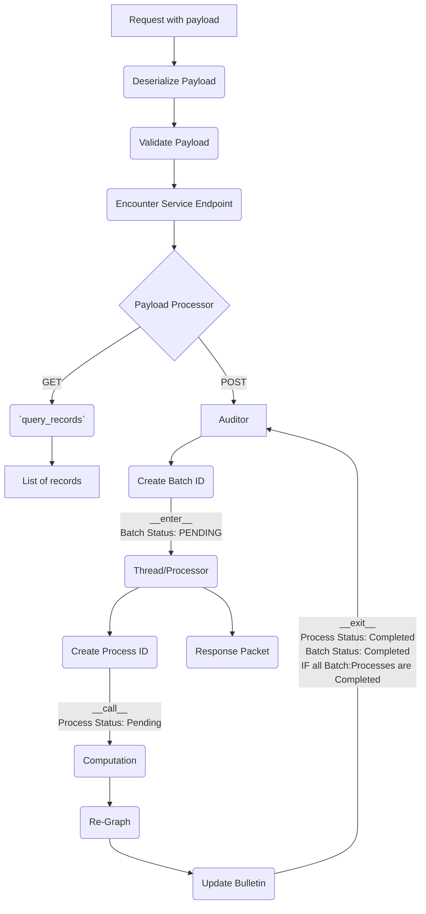
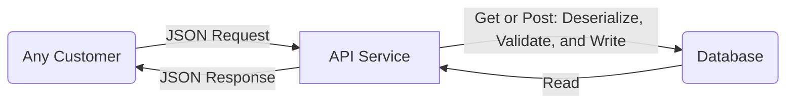
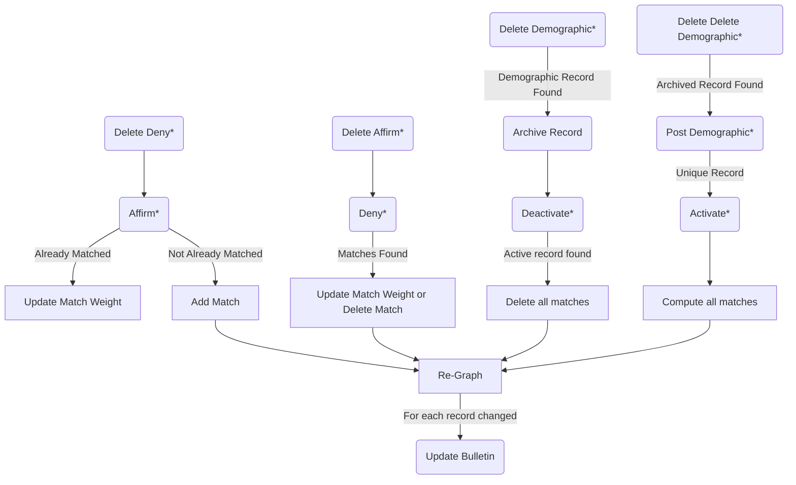
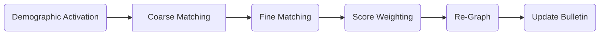
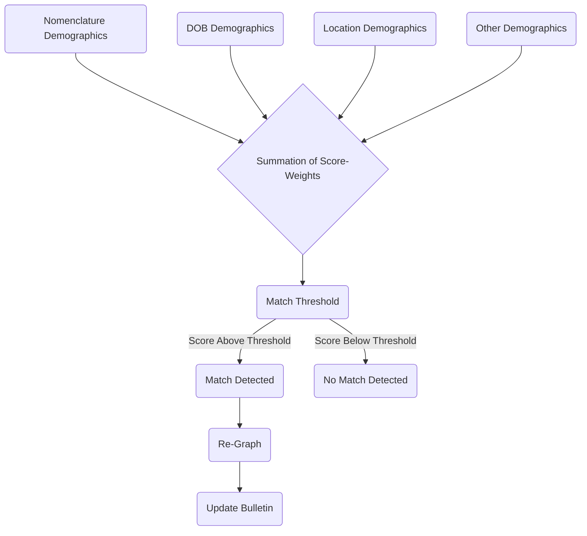
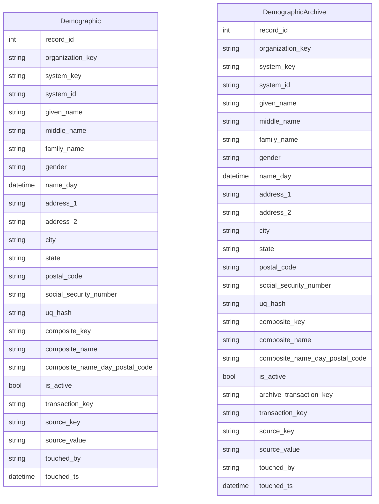
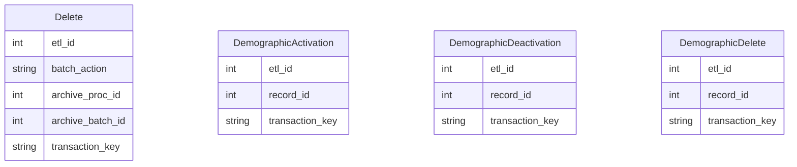
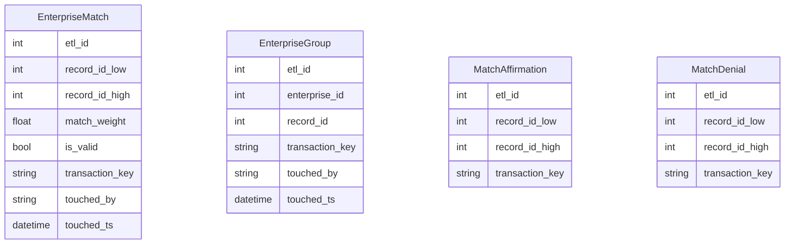
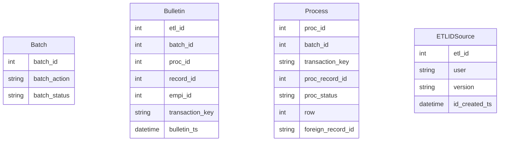

# `master-patient-index`
Master Patient Index is a containerized API microservice with a PostgreSQL database
MPI is used to improve the interoperability of medical records by conducting entity resolution (matching) on patient records.
Improved entity resolution on patient records is vital because medical errors are a huge cause of death in the United States. Chart errors and duplication of records has other big impacts on facilities' costs as well.

MPI is conceptualized as a data warehouse using dimensional data modeling practices that sits alongside your own data pipeline. You `post` patient demographic records to the warehouse and those records are activated into the network of patient graphs. If a record is matched to any given record(s), they will share an `enterprise_id` as a unique serial number representing a patient. The `enterprise_id` is clad from the lowest ID in any group. Ongoing changes to these graphs are published to a `bulletin`.

The entire service lives inside a container and your instance(s) may be placed anywhere within your cloud security perimeter easily.

In sum, the following 8 cursor-behaviors (acting on your patient network) are supported via POST to a service endpoint:

>**Post Demographic**: adds and activates a demographic to your warehouse
> 
>**Delete Demographic**: deactivates, archives, and removes a demographic from your warehouse
> 
>**Activate Demographic**: adds the record as a node to the patient network and computes it with potential matches, updating the network as necessary
> 
>**Deactivate Demographic**: removes the record as a node from the patient network and re-computes the network in its absence
> 
>**Affirm Match**: adds 1.0 to the match-weight attribute of the match record 
> 
>**Deny Match**: subtracts 1.0 from the match-weight attribute of the match record
> 
>**Delete (Delete Demographic)**: fetches a deleted record from the archive, and passes it back in via a Post Demographic (above)
> 
>**Delete (Affirm or Deny)**: enacts the opposing behavior on request 
> 

MPI incorporates a fully audited data warehouse, where every transaction is reversible using the commands outlined above. MPI traces a complete record of everything that ever happens on MPI. This unleashes your total quality control processes according to your own customized design and any particular data quality needs you may have as well.

When demographic records are activated (as above), the newly introduced record is paired off with a collection of coarse matches. Each pair-wise comparison runs a battery of deterministic tests and stores these in an encrypted metric JSON object for storage on your volume (in "toy mode" (see below) this is bypassed and no metric files are created). Special encrypt/decrypt methods ensure these metric files are only legible inside the audited universe of the service to suit your access control and security needs.

Score-weighting refers to the activity of reading the metric object and assessing between 0 and 1 how likely the two records are representative of the same patient. Scores exist on a range of 0 to 1, with the threshold for matching currently set at 0.5.

A finalized score-weighting mechanism is **not supplied** because this needs to be responsive to your data quality. For instance, if your date of birth records are fantastic, you can assign them a higher score-weight on matches than if this data is of very poor quality, and so on with all other data attributes. One of the conceits of this application is that you can supply independent analytic heft. This is where.

Because this system handles an ongoing, human process, with a very special set of cursors to enable full reversibility, the state of your patient network and its collection of patient graphs is always, in the present moment, assumed to be your "least wrong" network. What this means, practically, is that most access to this service by the customer tranche interested in retrieving patient graphs and/or unique patient serials will do so by accessing or subscribing to the `bulletin`. Put another way, the serialization here is not meant to be stored elsewhere, but fetched at customers' own run-time, when and as needed.  

---

# Getting Started
It's as easy as...
## 1 - Install Docker, Python, and Flask, and this Repo
Developed with Docker version 23.0.5, build bc4487a  
Python 3.10  
Flask 2.2.2

## 2 - Set up three hidden files your Docker build will rely on
Place these .env files in `/` with your own `username`, `password`, and `database`. The filename starts with a `.` because these are meant to be hidden files.

### .env.dev
FLASK_APP=project/__init__.py  
FLASK_DEBUG=1  
DATABASE_URL=postgresql://`username`:`password`!@db:5432/`database`  
SQL_HOST=db  
SQL_PORT=5432  
DATABASE=postgres  
APP_FOLDER=/usr/src/app  

### .env.prod
FLASK_APP=project/__init__.py  
FLASK_DEBUG=1  
DATABASE_URL=postgresql://`username`:`password`!@db:5432/`database`  
SQL_HOST=db  
SQL_PORT=5432  
DATABASE=postgres  
APP_FOLDER=/home/app/web  

### .env.prod.db
POSTGRES_USER=`username`  
POSTGRES_PASSWORD=`password`  
POSTGRES_DB=`database`  

## 3 - Spin up a container
### Prod
>sudo docker compose -f docker-compose.yml up -d --build  
sudo docker compose exec web python manage.py create_db  
sudo docker compose -f docker-compose.yml down -v  
sudo docker compose exec db psql --username=<username> --dbname=<database>  

The `create_db` command above should only be run once (on initial start) or whenever you really want to give the DB a blow-out.

This container uses Gunicorn and Nginx, and its own database and volume.

### Dev
>sudo docker compose -f docker-compose.dev.yml up -d --build  
sudo docker compose -f docker-compose.dev.yml down -v  
sudo docker compose exec db psql --username=<username> --dbname=<database>  

The dev container uses the flask development web server, and its own database and volume. This container runs `create_db` on startup.

---

# Product Philosophy and Vision

This product is intended to have 5 key values. The solution:
>- enables a human process
>- provides an elegant interface
>- has independent/DIY score-weighting for matches
>- is truly agnostic of your existing tooling
>- is open source

There are 8 product design conceits which we believe improve the yield of this system:
>- the battery of deterministic tests yields a stored metric for repeatability
>- the activity of match-scoring is decoupled from computing the metric (maintaining a posture that you can always go back and apply new weights, or even new tests)
>- this means variable match-scoring is a native feature
>- the graph cursor is placed in the hands of your clinicians
>- the real state of your demographic data store is also in the hands of your clinicians
>- the warehouse maintains a robust audit trail
>- any UI or workflow may be built on top of the API easily
>- the graph cursor applies graph theory natively

We (try to) adhere to the following product-code principles:
>- there is a clear separation of concerns
>- each module does one thing and is short (under 250 lines/10kb, where possible)
>- each function does one thing and is short (clear exception: funcs working with SQLA can be long)
>- the name-space is clear, consistent, normative, and descriptive throughout
>- callable context managers (objects composed with `__call__`, `__enter__`, and `__exit__` implemented) provide full warehouse observability for every process whatsoever and ensure the service architecture is tightly wrapped, everywhere 
>- the correspondence between the service endpoints, data processors, payload validators, and the data model is intentionally maintained with a `coupler`
>- docstrings always; type-hints and other annotations are supplied as much as possible which is nearly always
>- the code is subject to static analysis (via PyCharm CE) and strictly maintained to all PEPs. 
>- testing at the "fair enough" level. Every module is validated, but this product has no devops opinion. This means it is light on integration tests, smoke tests, and test automation, broadly.

It is absolutely necessary that you create an airtight testing seal with additional coverage within the context of your own deployment.

---

# Project Details

To become a contributor to this project, read the [Code of Conduct](https://github.com/HealthIQ-LLC/master-patient-index/blob/main/CODE_OF_CONDUCT.md), pull my email out of it, and get in touch without hesitation.

As of now, there is no helpdesk automation or administration for issues, tickets, or anything else. This is a ground-floor project, and if you want commit-level access because you have a strong opinion about these features, let's talk!

---
# Service Endpoints

`POST` requests alter the patient network using processors uniquely dedicated to each endpoint, while `GET` requests provide visibility throughout the entire data model.

| Name                   | Route (`'/api_{version}/'...`) | Methods           |      
|------------------------|--------------------------------|-------------------|
| Activate Demographic   | `'activate_demographic'`       | `['GET', 'POST']` |
| Archive Demographic    | `'archive_demographic'`        | `['GET']`         |
| Deactivate Demographic | `'deactivate_demographic'`     | `['GET', 'POST']` |
| Delete Action          | `'delete_action'`              | `['GET', 'POST']` |
| Delete Demographic     | `'delete_demographic'`         | `['GET', 'POST']` |
| Demographic            | `'demographic'`                | `['GET', 'POST']` |
| Affirm Match           | `'match_affirm'`               | `['GET', 'POST']` |
| Deny Match             | `'match_deny'`                 | `['GET', 'POST']` |
| Enterprise Group       | `'enterprise_group'`           | `['GET']`         |
| Enterprise Match       | `'enterprise_match'`           | `['GET']`         |
| Batch                  | `'batch'`                      | `['GET']`         |
| Bulletin               | `'bulletin'`                   | `['GET']`         |
| Process                | `'process'`                    | `['GET']`         |
| ID Source              | `'etl_id_source'`              | `['GET']`         |

---
# Code Tour
The Docker container is built from `/`. The python package itself is in `/services/web/project`.

- `__init__`: all payload processing is wrapped, and endpoint rules are registered
- `__version__`: just the software version
- `app`: Flask `app` object is created and configured
- `auditor`: supplies a callable context-manager to trace all transactions
- `coupler`: intentional coupling of data model, data processor, payload validator, and supported protocol methods
- `crypto_s3`: an encrypted getter/setter for handling metric results data. Not fully implemented and not tested at this time
- `data_utils`: some helper functions for handling data idiomatically
- `engine`: match-computation is orchestrated here, metrics result
- `graphing`: arranging graphs from metrics and updating the database
- `logger`: a formatted, leveled, handled, named, and located logging object
- `matching`: a battery of deterministic string-matching tests
- `model`: the database connection context, `db`, and the entire data model of tables which are bound to endpoints via `coupler`
- `processor`: A wrapper for all transactions and selections, status updates, and 8 unique data processors which are bound to endpoints via `coupler`
- `validators`: validating client payloads with custom validators which are bound to endpoints via `coupler`

---
# Visuals

## Request Flow

This is an overview of how every API request is handled. It demonstrates how the `Auditor` wraps requests, and how confirmation responses are issued immediately while threads that do computation are kicked off in the background.

## API Interaction Flow

If you post a new record, the response object gives you a record locator you can later use to check the `Bulletin` upon confirming your `Batch` is complete. Essentially, after your initial `POST`, you come back with your record locators and make `GET` requests to acquire pertinent network updates.

## API Commands Flow

(*) Corresponds to an endpoint supporting POST

This system of cursoring over demographic records as Nodes and match records as Edges makes heavy re-use of itself such that all supported commands fall along this flow-chart. 

## Matching Engine Flow

## Score-Weighting Flow

---

# Data Model

Throughout this model:

- `record_id` serializes demographic records
- `etl_id`, `batch_id`, `proc_id` serialize record locators for requests
- `transaction_key` serializes database transactions; it combines a `batch_id` and `proc_id`
- `empi_id` serializes patients

## Demographic Records

## Activating, Deactivating, Deleting, Restoring Demographic Records

## Match Records and Group Records

## Data Warehouse Meta-Records
